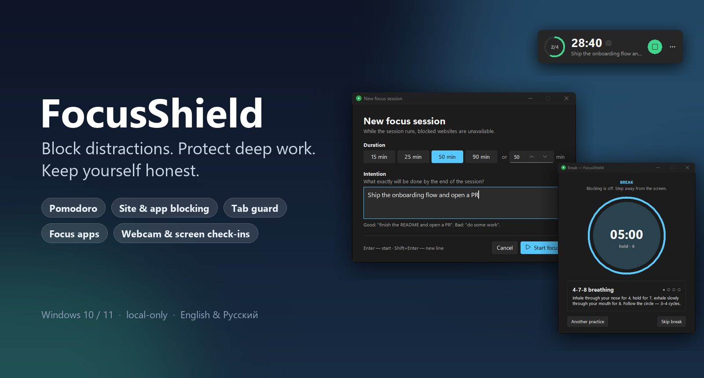
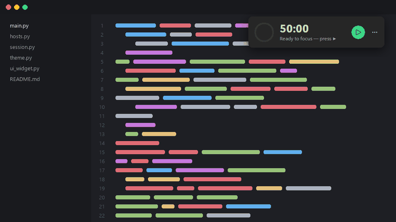
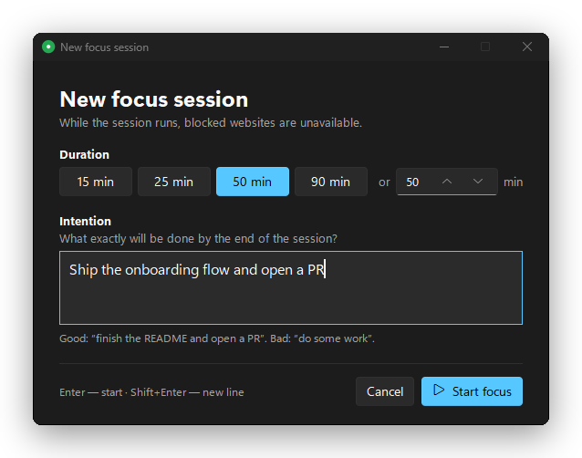
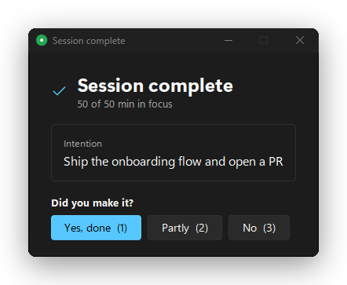
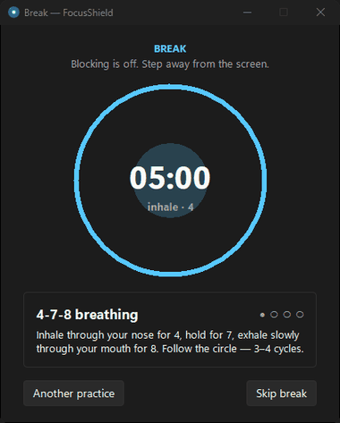
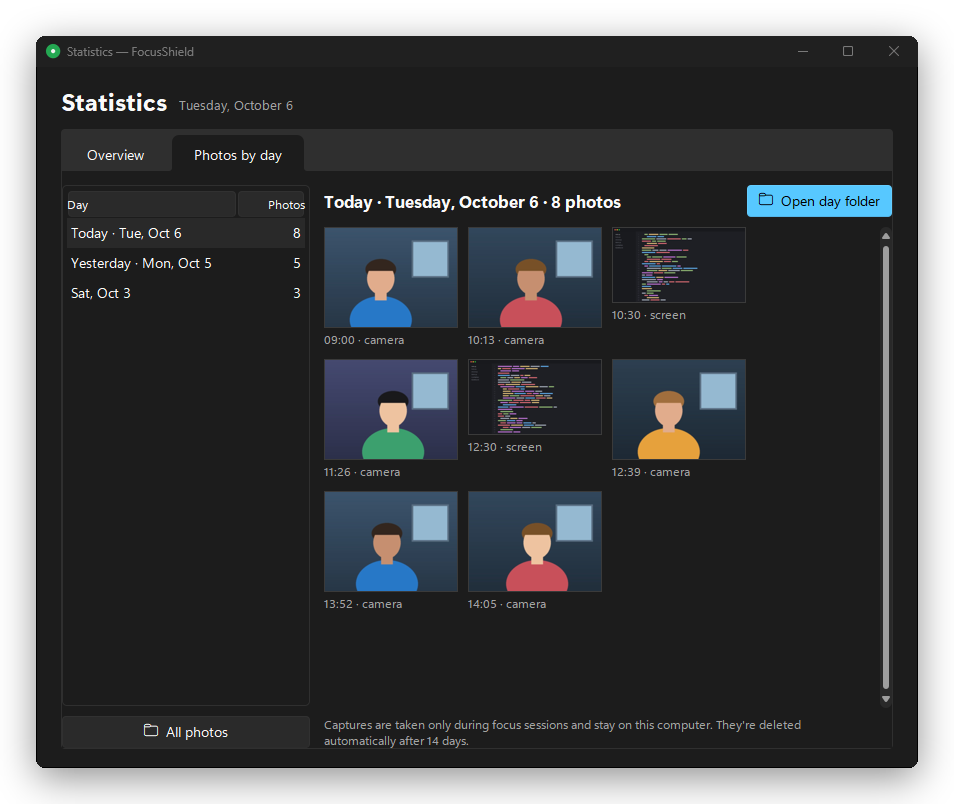
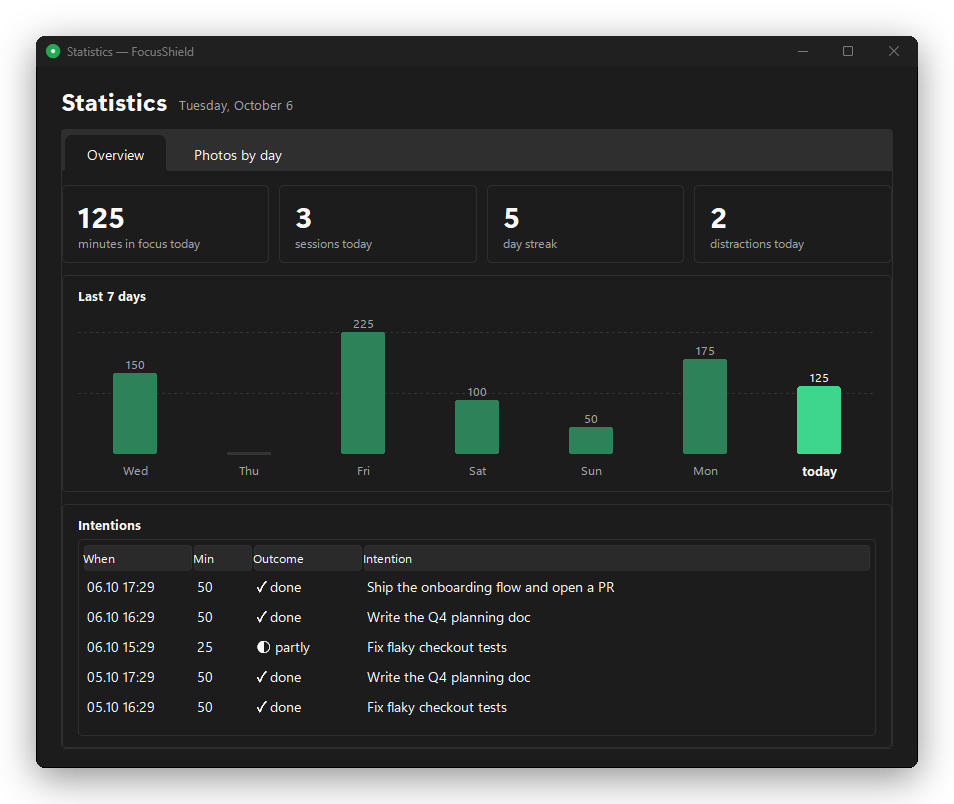
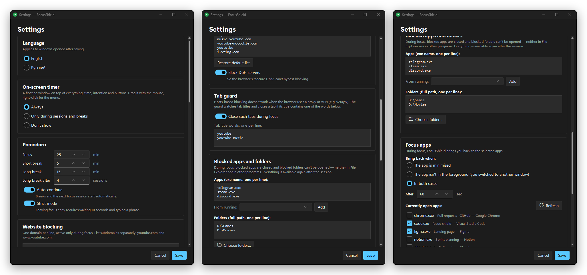
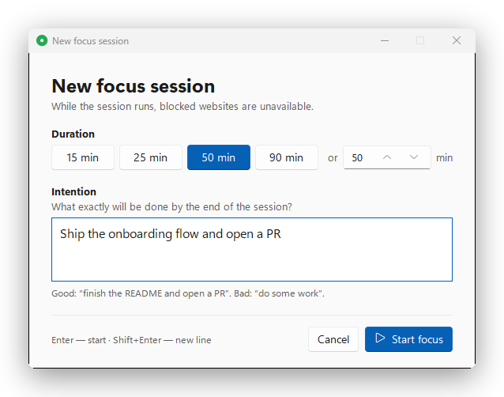
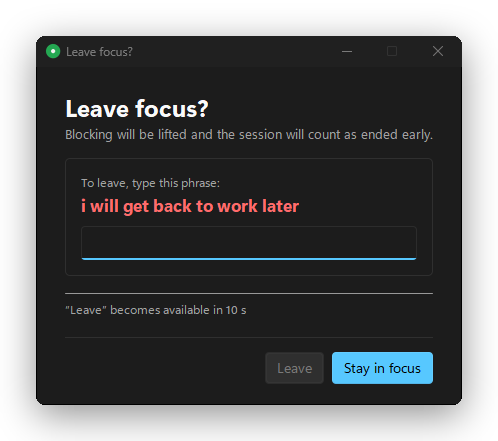

<div align="center">



# FocusShield

**A strict, beautiful focus timer for Windows that actually blocks distractions —<br>
websites, browser tabs, apps and folders — and helps you keep yourself honest.**


<a href="https://github.com/bigdevwhale/focus-shield/releases/latest/download/FocusShield.exe"></a>

[Features](#-features) · [Install](#-install) · [How it works](#-how-it-works) · [FAQ](#-faq) · [Русский](README.ru.md)

</div>

---

## Why FocusShield?

Most focus apps are a timer with good intentions. You start a session, get
bored, open YouTube "for one minute"… and the timer politely keeps ticking.

FocusShield is built around **friction**. Once a focus session starts:

- 🚫 distracting **websites stop resolving**, system-wide;
- 🛡 a **tab guard** closes YouTube tabs even through a proxy or VPN;
- 🔒 chosen **apps get closed** and chosen **folders can't be opened**;
- 🎯 if you wander away from your **work apps**, they come back to the front;
- ⏳ ending a session early means **waiting 10 seconds and typing a phrase**.

When the session ends, everything unlocks automatically — and you get a real break.

---

## ✨ Features

### ⏱ A timer that's always in view

A compact floating timer sits on top of every window: progress ring, time left,
your intention and one-click controls. Drag it anywhere — it remembers the spot.
Show it **always**, **only during sessions**, or **never**.

<p align="center"></p>

### 🎯 Start with an intention, finish with a check-in

Every session starts with *what exactly will be done*. When it ends, FocusShield
shows the intention back to you and asks: **did you make it?** Your answers
build an honest history.

<p align="center">
  
  
</p>

### 🌿 Breaks that actually restore you

Blocking lifts and a break window guides you through micro-practices:
**4-7-8 breathing** with an animated circle, the **20-20-20 eye rule**,
a stretch and a glass of water. Long break after every *N* sessions.

<p align="center"></p>

### 🛡 Blocking that holds up

| Layer | What it does | Survives proxy / VPN? |
|---|---|:---:|
| **Websites** | Domains from your list resolve to `0.0.0.0` via the `hosts` file; DNS-over-HTTPS servers are blocked too, so the browser's "secure DNS" can't sneak around it | ❌ |
| **Tab guard** | Watches browser window titles and closes a tab whose title contains a keyword (`YouTube` by default). Exact segment matching — a search for *"how to block youtube"* or a file called `youtube.py` is never touched | ✅ |
| **Apps** | Processes on your list are closed during focus (Telegram, Steam, Discord…) | ✅ |
| **Folders** | An NTFS *deny-read* rule on the folder — Explorer and every other program get "access denied"; open Explorer windows close | ✅ |

System processes and critical folders (Windows, Program Files, drive roots, your
whole profile) are refused on purpose — FocusShield can't brick your PC.

### 🎯 Focus apps

Pick the apps you work in. Choose when FocusShield brings you back:
when the app is **minimized**, when it's **not in the foreground**
(you switched to something else), or **both**. Its own windows never count.

### 📸 Optional webcam & screen check-ins

A webcam photo and/or a screenshot every *N* minutes, **only during focus**,
stored locally in one folder per day. Browse them by day, open a day's folder in
one click. Old captures are deleted automatically.

<p align="center"></p>

### 📊 Stats & streaks

Minutes in focus, sessions, day streak, distractions caught, a 7-day chart and
every intention with its outcome.

<p align="center"></p>

### ⚙️ Everything is configurable

Pomodoro lengths, strict mode, auto-continue, blocked sites, tab keywords,
blocked apps and folders, focus apps and triggers, captures, theme
(light / dark / follow Windows) and language (English / Русский).

<p align="center"></p>

<p align="center">
  
  
</p>

---

## 🚀 Install

### Download (recommended)

1. Grab **[FocusShield.exe](https://github.com/bigdevwhale/focus-shield/releases/latest/download/FocusShield.exe)**
   from the [latest release](https://github.com/bigdevwhale/focus-shield/releases/latest) — one file, no Python needed.
2. Run it and accept the administrator prompt.
3. That's it — FocusShield adds itself to Windows startup and lives in the tray.

> **SmartScreen:** the exe isn't code-signed, so Windows may show
> *"Windows protected your PC"*. Click **More info → Run anyway**. Every release
> is built from source by [GitHub Actions](.github/workflows/release.yml) and
> ships with a `.sha256` checksum.

> **Tip:** Windows 11 hides new tray icons. Drag the FocusShield icon out of the
> `^` overflow area so it's always visible.

### From source

Requires **Python 3.10+** from [python.org](https://www.python.org/downloads/) (with tkinter — the default).

```powershell
git clone https://github.com/bigdevwhale/focus-shield.git
cd focus-shield
python install.py      # run from source, with autostart
python build.py        # …or build your own dist\FocusShield.exe
```

### Usage

1. Press **▶** on the floating timer (or left-click the tray icon).
2. Pick a duration, write your intention, hit **Start focus**.
3. Work. FocusShield does the rest.

Right-click the tray icon or the timer for **Statistics**, **Photos by day** and **Settings**.

### Uninstall

```powershell
FocusShield.exe --uninstall    # or, from source: python uninstall.py
```

Removes autostart and lifts all blocks. Your stats and photos stay in
`%LOCALAPPDATA%\focus-shield` — delete the folder if you don't need them.

---

## 🔧 How it works

FocusShield is a small Python app: a system-tray icon (`pystray`), a Windows 11
style UI (`tkinter` + the Sun Valley theme), toasts (`winotify`) and plain
WinAPI via `ctypes` for windows, processes and folder permissions.

- **Single-file exe** built with PyInstaller. On first run it registers a Task
  Scheduler entry at logon with highest privileges, so there's no UAC prompt
  on every boot. Launching it again just brings the running instance forward.
- **Crash-safe.** Session state is written atomically with absolute end
  times. On every start, FocusShield removes all of its blocks and then resumes
  an unfinished session — nothing stays blocked by accident.
- **Strict by design.** If the app is killed mid-session, blocks stay until it
  restarts (the scheduled task restarts it automatically).
- **One UI thread.** The tray thread only posts events into a queue; a
  one-second tick drives the state machine, timer, guards and captures.

| File | Responsibility |
|---|---|
| `main.py` | orchestrator: event queue, tick, session lifecycle, recovery |
| `hosts.py` | marked section in the `hosts` file, DNS flush, debug CLI |
| `blocker.py` | blocked apps (processes) and folders (NTFS deny rules) |
| `focus_apps.py` | window tracking: focus apps and the tab guard |
| `session.py` | pomodoro state machine with an atomic `state.json` |
| `webcam.py` | webcam photos and screenshots, folders per day, cleanup |
| `stats.py` | SQLite: sessions, distractions, streaks |
| `theme.py`, `i18n.py` | design system and translations |
| `ui_*.py` | timer widget, dialogs, break, stats, settings |
| `autostart.py` | Task Scheduler registration (used by the exe and `install.py`) |
| `build.py` | builds `dist/FocusShield.exe`; CI runs it for every `v*` tag |

---

## ❓ FAQ

<details>
<summary><b>I use a proxy / VPN (v2rayN, xray, Clash…) and YouTube still opens</b></summary>

With a SOCKS/HTTP proxy, domain names are resolved by the proxy, so the `hosts`
file is never consulted. That's exactly what the **tab guard** is for: it works
on window titles, so it doesn't care how traffic is routed. Keep it enabled in
*Settings → Tab guard*.
</details>

<details>
<summary><b>Something stayed blocked — how do I unblock manually?</b></summary>

Run `FocusShield.exe --unblock` (it asks for admin rights). From source, in an
**administrator** terminal:

```powershell
python hosts.py --unblock     # websites
python blocker.py --unblock   # folders
```

Or uninstall completely with `FocusShield.exe --uninstall`. A backup of your original `hosts` file is
kept next to it as `hosts.focus-shield.bak`.
</details>

<details>
<summary><b>Is anything sent anywhere?</b></summary>

No. There are no network calls in the code. Photos, screenshots, stats and logs
live in `%LOCALAPPDATA%\focus-shield` and captures are deleted after the
retention period you set (14 days by default).
</details>

<details>
<summary><b>Can I cheat?</b></summary>

Of course — anyone with an admin terminal can kill a process. FocusShield is
**friction, not armor**: it makes the distracted path slow and deliberate,
which is usually all it takes.
</details>

<details>
<summary><b>What are the known limitations?</b></summary>

- The tab guard sees only the **active** tab of each browser window; a background
  tab is closed as soon as you switch to it.
- A folder block applies to the folder itself — a file inside can still be
  opened by its exact path (e.g. from *Recent files*).
- DNS-over-HTTPS pointed at a raw IP bypasses `hosts` (the tab guard still works).
- Windows only.
</details>

---

<div align="center">

**If FocusShield helps you ship, give it a ⭐ — it helps others find it.**

</div>
