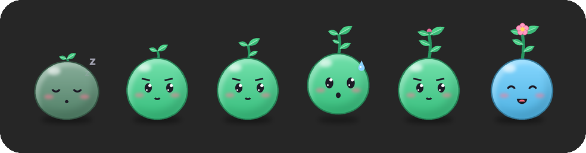

# FocusShield 🎯

[English](README.md) · **Русский** · [Сайт](https://bigdevwhale.github.io/stillcraft/apps/focusshield/)

Десктопная тулза концентрации для Windows 10/11. Помодоро-сессии, на время
которых отвлекающие сайты, приложения и папки недоступны. Фокус-приложения
сами возвращаются на передний план, а снимки с камеры и экрана помогают
держать себя в руках. Всё работает локально, без сети.

Интерфейс на английском или русском (Settings → Language), есть светлая и
тёмная тема в стиле Windows 11.

## Установка

### Скачать (проще всего)

1. Скачай **[FocusShield.exe](https://github.com/bigdevwhale/focus-shield/releases/latest/download/FocusShield.exe)**
   из [последнего релиза](https://github.com/bigdevwhale/focus-shield/releases/latest). Это один файл, Python не нужен.
2. Запусти его и разреши запрос прав администратора.
3. Готово: FocusShield сам добавится в автозапуск и появится в трее.

> **SmartScreen:** exe не подписан, поэтому Windows может показать «Система
> Windows защитила ваш компьютер». Нажми **Подробнее → Выполнить в любом
> случае**. Каждый релиз собирается из исходников в GitHub Actions, рядом
> лежит контрольная сумма `.sha256`.

Иконку в трее стоит вытащить из скрытой области `^`: ПКМ по панели задач →
параметры панели задач.

Удаление: `FocusShield.exe --uninstall`. Оно убирает автозапуск и снимает
все блокировки, а статистика и фото остаются в `%LOCALAPPDATA%\focus-shield`.

### Из исходников

Нужен Python 3.10+ (сборка с python.org, с tkinter).

```powershell
git clone https://github.com/bigdevwhale/focus-shield.git
cd focus-shield
python install.py      # запуск из исходников с автозапуском
python build.py        # …или собрать свой dist\FocusShield.exe
```

## Как пользоваться

- **Начать фокус**: ▶ на плавающем таймере, левый клик по иконке в трее
  или трей → «Начать фокус…». Выбираешь длительность и пишешь намерение:
  что конкретно будет сделано. В конце сессии намерение вернётся с вопросом
  «получилось?».
- **Плавающий таймер**: компактное окно поверх всех окон с кольцом
  прогресса, временем, намерением и кнопками. Перетаскивается мышью, правый
  клик открывает меню. Режимы: всегда / только в сессии / выключен.
- **Маскот-росток** (по желанию, настройки → «Таймер на экране»): сидит
  рядом с таймером и растёт вместе с серией помидоров — стебель тянется в
  каждом фокусе, с каждой сессией появляются листья, к концу серии бутон,
  а на длинном перерыве распускается цветок. Сосредоточен в фокусе,
  потеет в последнюю минуту, отдыхает на перерыве, дремлет в простое.
  Если ткнуть — подпрыгнет.

  <p align="center"></p>
- **Перерыв**: окно с «дышащим» кругом и микро-практиками (дыхание 4-7-8,
  глаза 20-20-20, разминка, вода). Блокировки на перерыве сняты.
- **Строгий режим**: выйти из фокуса досрочно можно, только подождав
  10 секунд и введя фразу.

## Что блокируется во время фокуса

| Что | Как | Обход |
|---|---|---|
| Сайты (по умолчанию YouTube) | hosts → `0.0.0.0` + блокировка DoH-серверов | прокси/VPN, DoH по IP |
| Вкладки браузера | **страж вкладок**: закрывает вкладку, если в её заголовке есть ключевое слово (`youtube`) | работает и через прокси/VPN |
| Приложения | процессы из списка закрываются (проверка раз в 2 с) | — |
| Папки | NTFS-запрет чтения для твоей учётки; открытые окна Проводника закрываются | — |

Список сайтов, слов, приложений и папок редактируется в настройках.
Системные процессы и папки (Windows, Program Files, корни дисков, профиль
целиком) заблокировать нельзя: это защита от поломки системы.

> **Прокси и VPN** (например, v2rayN/xray): при SOCKS имена резолвит сам
> прокси, поэтому hosts не участвует. YouTube в таком случае ловит страж
> вкладок.

## Фокус-приложения

Выбери в настройках приложения, в которых работаешь, и условие возврата:

- **свёрнуто**: приложение свёрнуто дольше порога;
- **не на переднем плане**: ушёл в другое окно дольше порога;
- **оба варианта**.

Окна самого FocusShield уходом не считаются.

## Снимки

Камера и скриншоты экрана включаются отдельно, у каждого свой интервал.
Снимки делаются только во время фокуса и лежат в
`%LOCALAPPDATA%\focus-shield\photos\ГГГГ-ММ-ДД\`. Скриншоты помечены
суффиксом `-screen`. Через N дней они удаляются автоматически.

Посмотреть их можно в трее → «Фото по дням»: там список дней, галерея и
кнопка «Открыть папку дня» (или двойной клик по дню).

## Аварийная разблокировка

Если приложение убито посреди сессии, блокировки остаются до его
следующего запуска (так задумано для строгого режима). Снять их вручную
проще всего командой `FocusShield.exe --unblock`. Из исходников это делается
в консоли **от администратора**:

```powershell
python hosts.py --unblock      # сайты
python blocker.py --unblock    # папки
```

Или просто запусти `python uninstall.py`. Резервная копия исходного hosts
лежит рядом с ним: `hosts.focus-shield.bak`.

## Приватность

- Снимки, статистика и логи лежат в `%LOCALAPPDATA%\focus-shield` и никуда
  не отправляются. Сетевых вызовов в коде нет.
- Снимки удаляются автоматически через `webcam_retention_days` (14 дней).

## Честные ограничения

- DoH по голому IP обходит hosts, но страж вкладок закроет вкладку
  YouTube по заголовку.
- Страж видит только активную вкладку окна. Фоновая вкладка с музыкой
  будет закрыта, как только ты на неё переключишься.
- Запрет папки ставится только на саму папку. Файл внутри по точному
  пути (например, из «Недавних») технически можно открыть.
- Действует только на этом ПК.
- Это трение, а не броня: из консоли администратора процесс можно убить.

## Отладка

```powershell
python hosts.py --status                   # состояние hosts
python hosts.py --block --hosts копия.txt  # тест на копии
python main.py                             # запуск в консоли с логами
```

Лог: `%LOCALAPPDATA%\focus-shield\focus.log`.
